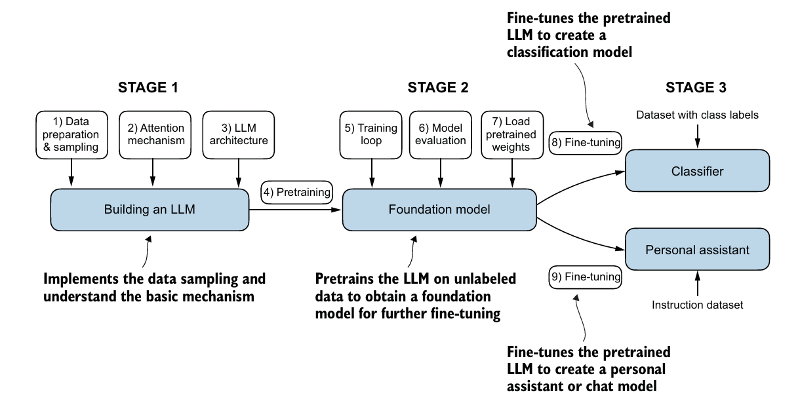
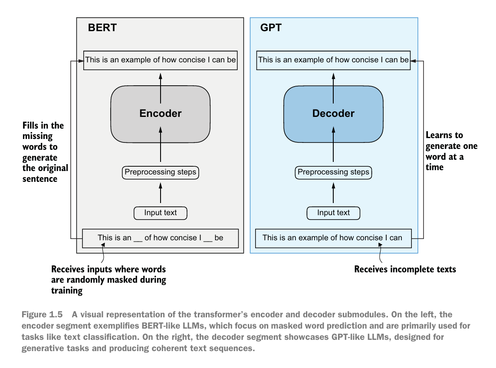
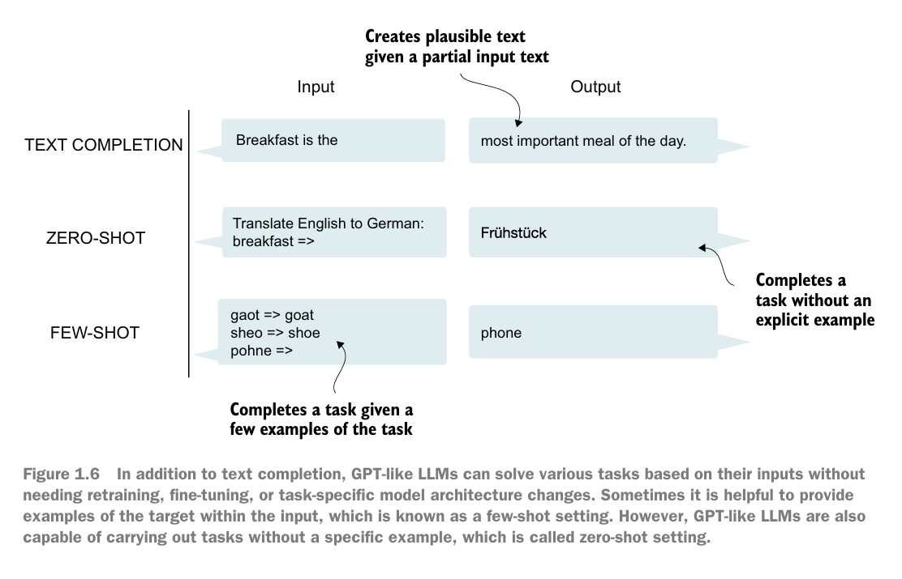
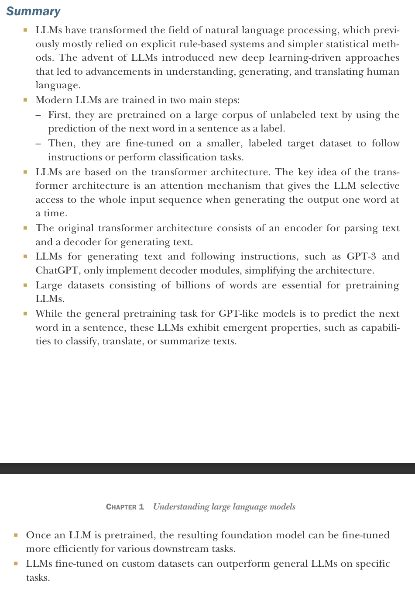

# Build LLM From Scratch

## _3 stages of building llm_

- **Explaination: on stage 1 and 2 we train the model with large amount of text data which is called foundational model then we fine tune it with labeled data to accomplish specific task.**

* **There are 2 popular types of fine tunning**
  1. **Instruction Fine tuning**
  2. **Classification Fine tuning**

## BERT vs GPT high level overview

#### GPT's ZERO and FEW shots

  

- GPT models are Decoder only models

### Summary of Chapter 1

