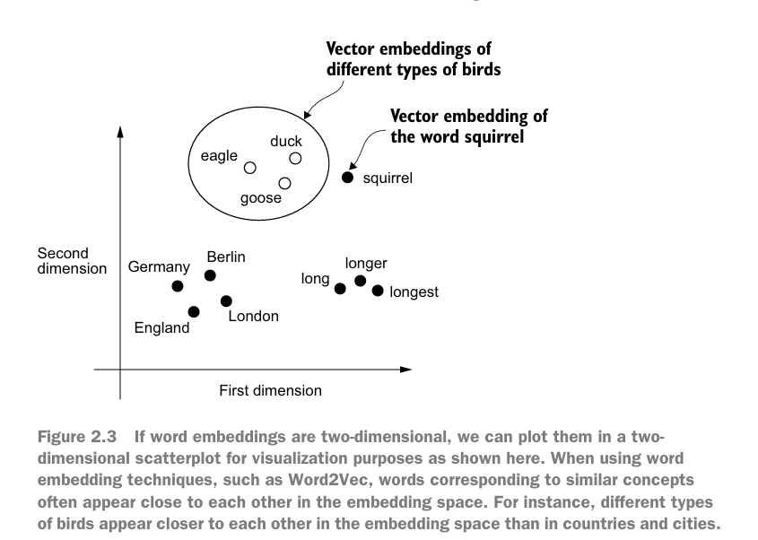

## Chapter 2

### Working with text data

- First we need to convert text/video/audio into vectors of number which is called `Embedding`
  - For Embedding we may need another embedding model
- Example of word embeddings
  

- The GPT uses Byte Pair encoding to tokenize
